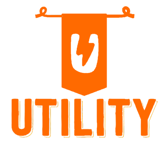
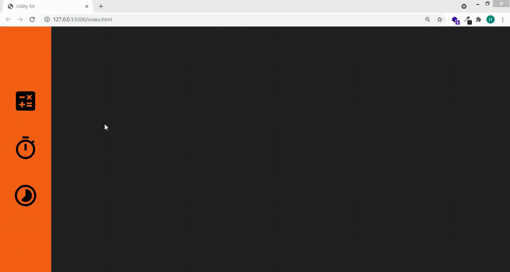

<h1 align="center">
  
</h1>

  <a href="#-technologies">Technologies</a>&nbsp;&nbsp;&nbsp;|&nbsp;&nbsp;&nbsp;
  <a href="#-project">Project</a>&nbsp;&nbsp;&nbsp;|&nbsp;&nbsp;&nbsp;
  <a href="#-objectives">Objectives</a>&nbsp;&nbsp;&nbsp;|&nbsp;&nbsp;&nbsp;

 

## 🚀 Technologies

This project was developed with the following technologies:

- HTML
- CSS
- JavaScript

## 💻 Project

Utility is an application that brings with it a resource pack containing the stopwatch, calculator and countdown functionality.

## :memo: Objectives

This project was created with the objective of improving concepts and techniques related to Javascript, HTML and CSS.

---
Made with ♥ by Hitalo 🚀